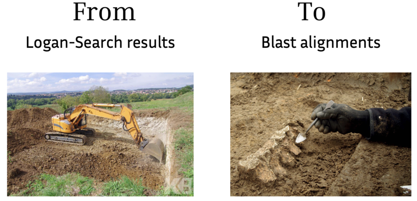

# Blast Logan-Search results against query




Given a query (fasta sequence), and a file containing list of SRA accessions (provided or not by Logan-Search results), run a local blast between the query and the subset of contigs or unitigs containing at least one shared k-mer with the query.

The `logan_blast.sh` script can be used 
- to directly retrieve the accessions from a Logan-Search session id, create the associated query file, and perform all alignements.
- or to provide a query file and an accessions file (accessions.txt) directly.

In any case, for each accession, it will run local blast between the query and the subset of contigs or unitigs containing at least one shared k-mer (k=17 by default) with the query (uses `back_to_sequences`), and save the results in a directory named `<accessions>.recruited_[contigs/unitigs]_vs_query`.


## Installation 
- blast: *on mac* `brew install blast` or look at [blast installation web page](https://ftp.ncbi.nlm.nih.gov/blast/executables/blast+/LATEST/)
- back_to_sequences: see [back_to_sequences installation web page](https://b2s-doc.readthedocs.io/en/latest/usage.html#installation])
- jq: see [jq installation web page](https://jqlang.org/)

## Running the `logan_blast.sh` script

```bash
./logan_blast.sh
  Usage: ./logan_blast.sh --session <logan seesion ID> or (--query <query_file.fa> --accessions <accessions.txt>) [--delete] [--kmer-size <k>] [--limit <n>]
  Options:
  Input choice1: session ID
    -s, --session     Logan session ID, eg. kmviz-b2bce461-ca13-4a45-b0b4-6c894eacf103
  Input choice2: accessions and query files
    -a, --accessions  Path to accessions.txt file. Containing one accession per line)
    -q, --query       Path to query fasta file
  Global options:
    -u, --unitigs     Consider the unitigs verison of the accessions instead of contigs
    -k, --kmer-size K-mer size for sequence recruitment with back_to_sequences (default: 17)
    -l, --limit     Limit number of accessions to process from accession file (default: no limit)
    -d, --delete    Delete recruited accessions and accessions files after processing (default: keep all files)
    -h, --help      Show this help message
```

## Example running from session.
```bash
./logan_blast_from_session.sh -s kmviz-b2bce461-ca13-4a45-b0b4-6c894eacf103
```

## Example running from accessions and query files.
This usage enables to select specific accessions to process, also ordering them, and to provide a custom query file.
### Creating accessions.txt
Logan-Search results can be used to create accessions.txt. Given a logan search result link or after exporting a table from Logan_search interface:

```bash
tail -n +2 kmviz-c21feaeb-4f33-4abc-b119-7db7bd47069b/query.tsv | awk '{print $1}' | tr -d "\"" > accessions.txt
```

### Running from query and accessions files

```bash
./logan_blast.sh  -a example/accessions.txt -q example/query.fa
```
